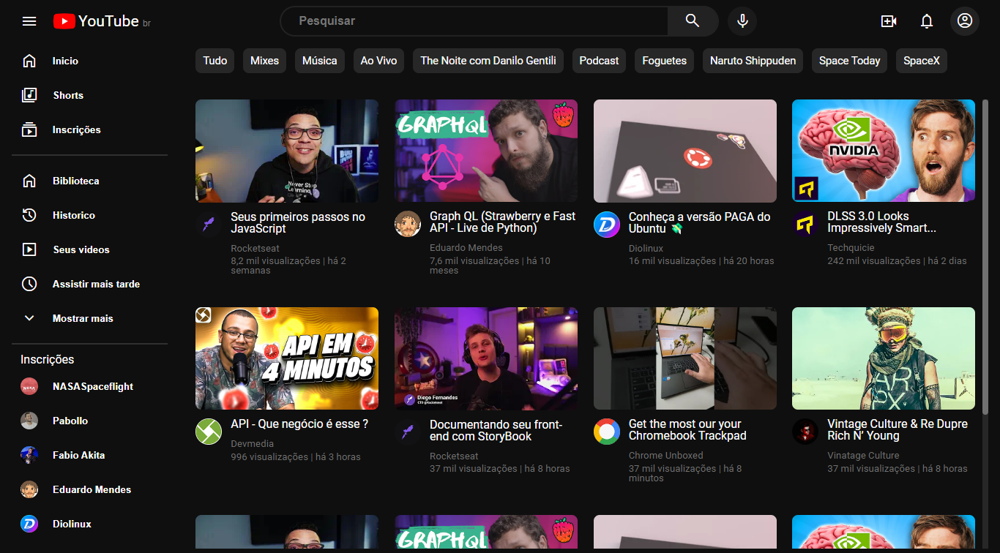
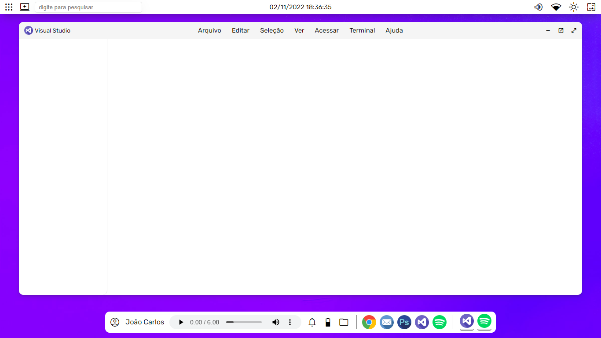

<h2>Copias de design de sites e aplicativos conhecidos para praticar<h2>  

<h2><b>Youtube</b><h2>
<h3>Desktop (Home)</h3>

<h3>Mobile (Home)</h3>
<h4>em breve...</h4>

<h2><b>Desktop Concept</b><h2>
<h3>Desktop (Home)</h3>

<h2><b>Netflix</b><h2>
<h3>Desktop (Home)</h3>
<h4>em breve...</h4>
<h3>Mobile (Home)</h3>
<h4>em breve...</h4>

<h2><b>Instagram</b><h2>
<h3>Desktop (Home)</h3>
<h4>em breve...</h4>
<h3>Mobile (Home)</h3>
<h4>em breve...</h4>

<h2><b>Windows 11</b><h2>
<h3>Desktop</h3>
<h4>em breve...</h4>
<h3>Mobile (Home)</h3>
<h4>em breve...</h4>

<h2><b>Twiter</b><h2>
<h3>Desktop</h3>
<h4>em breve...</h4>
<h3>Mobile (Home)</h3>
<h4>em breve...</h4>

<h2><b>Geforce Now</b><h2>
<h3>Desktop</h3>
<h4>em breve...</h4>
<h3>Mobile (Home)</h3>
<h4>em breve...</h4>

<h2><b>Github</b><h2>
<h3>Desktop</h3>
<h4>em breve...</h4>
<h3>Mobile (Home)</h3>
<h4>em breve...</h4>

